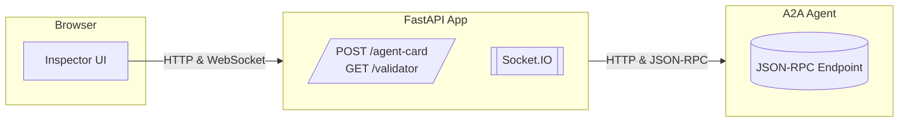
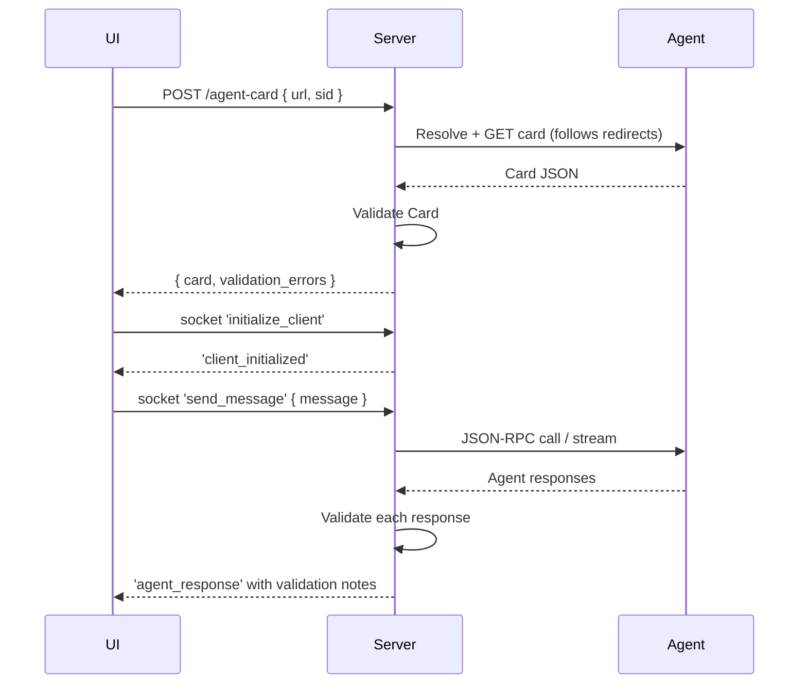

# A2A Validator 🔬


**A2A Validator** is a focused web app for testing AI agents that speak the **A2A (Agent-to-Agent) protocol**. Paste an agent URL, connect, and the app will fetch the agent’s discovery document, validate it against the protocol, and provide a real-time message terminal. It’s a tool designed for the build/integration loop: tight feedback, zero ceremony.

The backend runs on **FastAPI** and **Socket.IO**, with a lightweight HTML/JS frontend. The core validator checks both the static **Agent Card** and the live events an agent emits. If the optional `a2a-sdk` is present, it's used for card resolution and streaming; if not, the app gracefully falls back to a "plain HTTP" mode for basic card linting.

---

## ✨ Features

* **Inspector UI**: A clean interface at `/validator` to enter an agent URL and optional custom HTTP headers for auth or tenancy.
* **Smart Card Resolution**: Forgivingly handles root URLs by following redirects and probing common well-known paths (e.g., `/.well-known/agent.json`).
* **Inline Validation**: Pretty-prints the agent's JSON card and displays any validation errors or warnings directly in the UI.
* **Live Chat Terminal**: When the `a2a-sdk` is installed, a real-time terminal connects via Socket.IO to stream messages to and from the agent.
* **Real-time Message Linting**: Live messages are marked with ✅ (compliant) or ⚠️ (non-compliant). Click any message to view the raw JSON.
* **Integrated Debug Console**: A resizable console shows raw server-side request/response logs, minimizing the need for browser DevTools.

---

## 🚀 Quick Start

Create a virtual environment, install dependencies, and run the server:

```bash
# 1. Create venv and activate
python3 -m venv .venv
source .venv/bin/activate

# 2. Install dependencies for editable mode
pip install -e .

# 3. Run the development server
make run
````

or
```bash
uvicorn app.main:app --host 0.0.0.0 --port 7860 --reload
```

Point your browser to the Inspector UI:

➡️ **http://localhost:7860/validator**

You can also test the card fetch endpoint directly from your terminal:

```bash
curl -s -X POST localhost:7860/agent-card \
  -H 'content-type: application/json' \
  -d '{"url":"http://localhost:8080/","sid":"test"}' | jq
```

## Installation (Docker) — pull from Docker Hub or GHCR

You can run A2A Validator as a single container. Choose your preferred registry, pull the image, and map a port.

> Replace placeholders with your image path and tag:
>
> * Docker Hub: `docker.io/ruslanmv/a2a-validator`
> * GHCR: `ghcr.io/ruslanmv/a2a-validator`

### Option 1 — Docker Hub

```bash
# Pull
docker pull docker.io/ruslanmv/a2a-validator

# Run (maps host 7860 → container 7860)
docker run --rm -p 7860:7860 docker.io/ruslanmv/a2a-validator
```

### Option 2 — GitHub Container Registry (GHCR)

If needed, authenticate first:

```bash
echo "$GITHUB_TOKEN" | docker login ghcr.io -u <github-username> --password-stdin
```

Then pull and run:

```bash
docker pull ghcr.io/ruslanmv/a2a-validator

docker run --rm -p 7860:7860 ghcr.io/ruslanmv/a2a-validator
```

### Quick smoke test

With the container running locally:

```bash
# Open the UI
# http://localhost:7860/validator

# Optional: test the card endpoint
curl -s -X POST http://localhost:7860/agent-card \
  -H 'content-type: application/json' \
  -d '{"url":"http://localhost:8080/","sid":"test"}' | jq
```

To stop it, press `Ctrl+C` (foreground) or `docker stop <container-id>` if you ran it detached.


-----

## 🛠️ How It Works

The validator checks for common issues that break interoperability.

  * **Agent Card Validation**: It checks for required fields (`name`, `description`, `url`, `capabilities`, `skills`, etc.), correct types, a semver-like version string, and a valid absolute URL.
  * **Message Validation**: During a live session, it validates incoming events based on their `kind`. For example, `task` events must have an `id` and `status.state`, while `message` events must have a `parts` array and the correct `role`.

### Architecture



### Sequence Diagram


### Example card


-----

## ⚙️ Configuration & Endpoints

The application is designed to work out of the box with minimal setup.

  * `GET /validator`: Serves the Inspector UI.
  * `POST /agent-card`: The API endpoint for fetching and validating an Agent Card.
  * `/socket.io`: The path for real-time WebSocket connections.
  * `/healthz` & `/readyz`: Standard health check endpoints.

Static assets are served from `app/static` and templates from `app/templates`. The main UI is `validator.html`, which extends a base template. The server creates an alias for `/agent-card` at the root, so the frontend script works correctly even when the validator is embedded in a larger application.

-----

## 🔍 Troubleshooting

  * **307 Temporary Redirect**: If you paste a root URL (e.g., `http://my-agent/`) and see this, it often means the agent is redirecting to a docs page. The validator will automatically try to find the card at common paths like `/.well-known/agent.json`. If it still fails, try pasting the direct URL to the agent card JSON file.
  * **404 Not Found on `/agent-card`**: Ensure the API route alias is correctly configured in your `app/main.py` file. This is crucial if the `validator_service` router is mounted behind a prefix.
  * **"A2A SDK not installed"**: This is not an error but a feature. The app is running in its lightweight, HTTP-only mode. To enable chat and streaming tests, install the `a2a-sdk` package (`pip install "a2a-sdk[http-server]"`).

-----

## 📜 License

This project is licensed under the **Apache-2.0 License**. Use it, tweak it, ship it.
